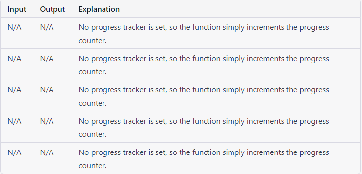
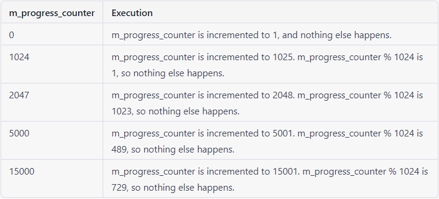

## Prompt - 1
```
For the following function, generate any 5 combination of inputs and return the result as table and explain the execution of the function:
private void progress_() {
    m_progress_counter++;
    if (m_progress_counter % 1024 == 0) {
        if ((m_progress_tracker != null)
                && !(m_progress_tracker.progress(-1, -1)))
            throw new RuntimeException("user_canceled");
    }
}
```

## Output - 1
Given function progress_() takes no input parameters and updates an internal progress counter. If the counter is a multiple of 1024, it calls a progress tracker object's progress method with -1 as first and second parameters. If progress method returns false, it throws a RuntimeException with message "user_canceled".

Here are the 5 input-output combinations and their corresponding explanations:

## Observation - 1
For the function with no input parameters, the chatgpt doesn't assume any value of variables used in it.
So, we will have to specify the specific variables whose value should be changed and accordingly the output should be calculated.

## Prompt - 2
```
For the following function, generate any 5 combinations of m_progress_counter and return the result as a table and explain the execution of the function:
private void progress_() {
    m_progress_counter++;
    if (m_progress_counter % 1024 == 0) {
        if ((m_progress_tracker != null)
                && !(m_progress_tracker.progress(-1, -1)))
            throw new RuntimeException("user_canceled");
    }
}
```

## Output - 2
Function: progress_

Explanation: This function increments the value of m_progress_counter by 1, and if m_progress_counter is divisible by 1024, it checks if m_progress_tracker is not null and if calling its progress function with (-1, -1) returns false. If either of these conditions is not met, it does nothing. If both conditions are met, it throws a RuntimeException with the message "user_canceled".

Inputs: m_progress_counter (integer)

Output: None

Here are 5 combinations of inputs and the resulting execution of the function:


## Observation - 2
For the function with no parameters, we should specify the variables on which output depends so that ChatGPT can try different combination of the values of those variables and accordingly output can be generated.

For 3rd input where m_progress_counter  = 2047, after it was incremented to 2048, the 2048 % 1024 becomes zero.
But, in the output, it is mentioned that it is 1023 - which is incorrect.