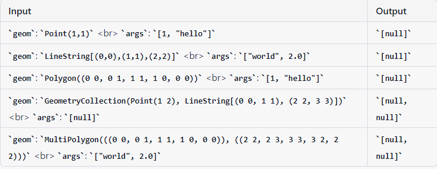
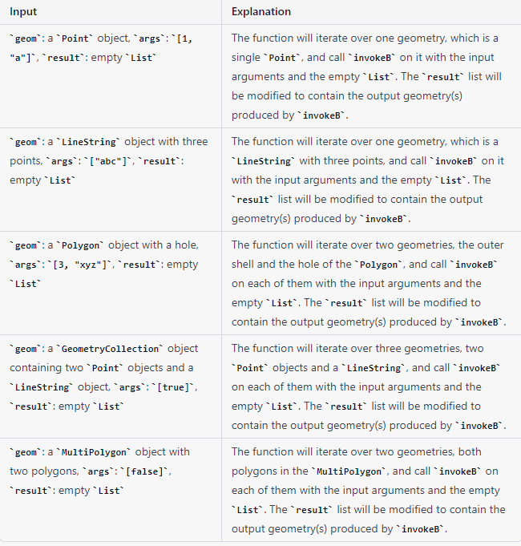

## Prompt - 1
```
For the following function, generate any 5 combinations of inputs and return the result as a table and explain the execution of each input-output combination: 
private void invokeEachA(Geometry geom, Object[] args, List<Geometry> result) {
    int nElt = geom.getNumGeometries();
    for (int i = 0; i < nElt; i++) {
      Geometry geomN = geom.getGeometryN(i);
      invokeB(geomN, args, result);
    }
}
```

## Output - 1
Sure, here are five combinations of inpu ts and their corresponding outputs:
<br/>

This function takes a Geometry object and an array of arguments, and recursively calls the invokeB method on each sub-geometry of the input Geometry. The invokeB method populates the result list with the results of each call.

For example, if the input Geometry is a Point object and the args array contains two elements, the invokeEachA method will simply call the invokeB method with the input Point object and the args array, and then add the result (which is always null in this case) to the result list.

If the input Geometry is a GeometryCollection object, which contains multiple sub-geometries, the invokeEachA method will recursively call itself on each sub-geometry, effectively traversing the entire geometry tree. The result list will then contain the results of all the invokeB calls for each sub-geometry.

## Observation - 1
1. If function is not returning anything, ChatGPT generates all output as null. We may have to update prompt such that for function with void return type, ChatGPT will give info of other elements getting impacted for different inputs.
2. ChatGPT doesn't consider the input's different combination if it is not causing any branching in the code flow. (Here it was)

## Prompt - 2
```
For the following function, generate any 5 combinations of inputs, return the result as a table and explain the execution of each input-output combination. 
Explain the behaviour of function for each input combination: 
private void invokeEachA(Geometry geom, Object[] args, List<Geometry> result) {
    int nElt = geom.getNumGeometries();
    for (int i = 0; i < nElt; i++) {
      Geometry geomN = geom.getGeometryN(i);
      invokeB(geomN, args, result);
    }
}
```

## Output - 2
The function invokeEachA takes a Geometry object, an array of Object arguments, and a List of Geometry objects as inputs. It iterates over all the geometries contained in the input Geometry object and calls the invokeB function on each of them with the same input arguments and output List. The output is not returned explicitly, but is added to the result list.

Here are five example input-output combinations:


## Observation - 2
Asking ChatGPT to explain about behaviour of function though it is not returning anything, gives us idea about execution of function for different types of inputs.
