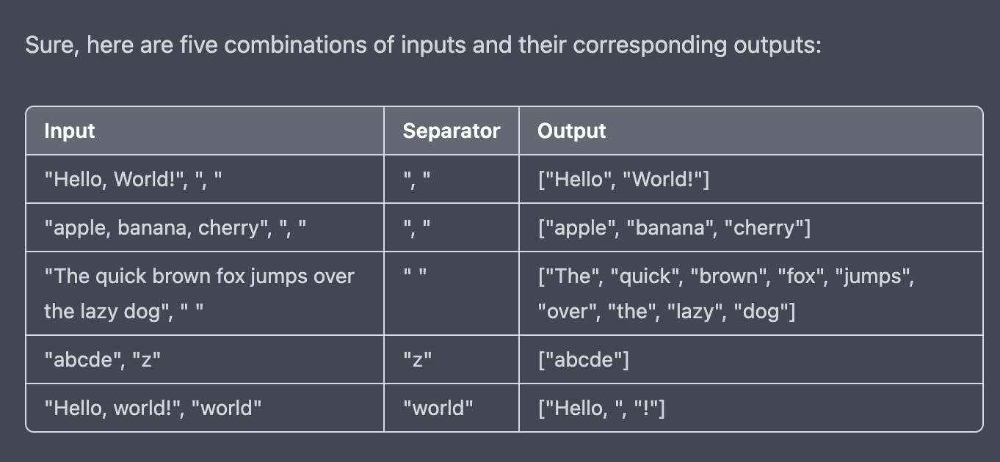

## Prompt - 1
```
For the following function, generate any 5 combinations of inputs and return the result as a table and explain the execution of each input-output combination: 
public static String[] split(String s, String separator) {
    int separatorlen = separator.length();
    ArrayList<String> tokenList = new ArrayList<>();
    String tmpString = "" + s;
    int pos = tmpString.indexOf(separator);
    while (pos >= 0) {
        String token = tmpString.substring(0, pos);
        tokenList.add(token);
        tmpString = tmpString.substring(pos + separatorlen);
        pos = tmpString.indexOf(separator);
    }
    if (tmpString.length() > 0)
        tokenList.add(tmpString);
    String[] res = new String[tokenList.size()];
    for (int i = 0; i < res.length; i++) {
        res[i] = tokenList.get(i);
    }
    return res;
}
```

## Output - 1
Input-output combinations:


In the first example, the input string is "Hello, World!" and the separator is ", ". The function splits the string at every occurrence of the separator and returns an array of the resulting tokens: ["Hello", "World!"].

In the second example, the input string is "apple, banana, cherry" and the separator is ", ". The function splits the string at every occurrence of the separator and returns an array of the resulting tokens: ["apple", "banana", "cherry"].

In the third example, the input string is "The quick brown fox jumps over the lazy dog" and the separator is " ". The function splits the string at every occurrence of the separator and returns an array of the resulting tokens: ["The", "quick", "brown", "fox", "jumps", "over", "the", "lazy", "dog"].

In the fourth example, the input string is "abcde" and the separator is "z". Since the separator does not appear in the input string, the function returns an array with a single element: ["abcde"].

In the fifth example, the input string is "Hello, world!" and the separator is "world". The function splits the string at every occurrence of the separator and returns an array of the resulting tokens: ["Hello, ", "!"]. Note that the separator itself is not included in any of the tokens.

## Observation - 1
- The input-output combinations generated by ChatGPT are correct.