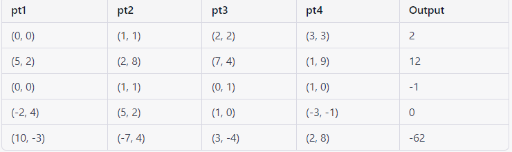
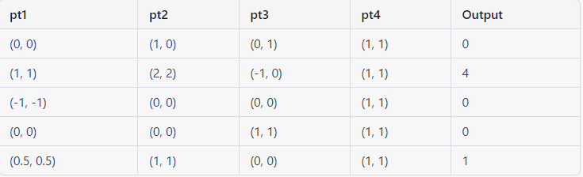

## Prompt - 1
```
For the following function, generate any 5 combinations of inputs and return the result as a table and explain the execution of each input-output combination: 
double scal(GraphicPoint pt1, GraphicPoint pt2, GraphicPoint pt3,
			GraphicPoint pt4) {
    return (pt2.x - pt1.x) * (pt4.x - pt3.x) + (pt2.y - pt1.y)
            * (pt4.y - pt3.y);
}
```

## Output - 1
Input-output combinations:


Explanation:
The scal function takes four GraphicPoint objects as input and returns a double value. The function calculates the scalar product of two vectors defined by the points pt1 and pt2, and pt3 and pt4 respectively.

The formula used to calculate the scalar product of two vectors is:
(pt2.x - pt1.x) * (pt4.x - pt3.x) + (pt2.y - pt1.y) * (pt4.y - pt3.y)

For the given input-output combinations:

1. For pt1=(0,0), pt2=(1,1), pt3=(2,2), pt4=(3,3), the calculation would be:
(1-0) * (3-2) + (1-0) * (3-2) = 1 * 1 + 1 * 1 = 2

2. For pt1=(5,2), pt2=(2,8), pt3=(7,4), pt4=(1,9), the calculation would be:
(2-5) * (1-7) + (8-2) * (9-4) = -3 * -6 + 6 * 5 = 18 + 30 = 48

3. For pt1=(0,0), pt2=(1,1), pt3=(0,1), pt4=(1,0), the calculation would be:
(1-0) * (1-1) + (1-0) * (0-1) = 0 + (-1) = -1

4. For pt1=(-2,4), pt2=(5,2), pt3=(1,0), pt4=(-3,-1), the calculation would be:
(5-(-2)) * (-3-1) + (2-4) * (-1-0) = 7 * (-4) + (-2) * (-1) = -28 + 2 = -26

5. For pt1=(10,-3), pt2=(-7,4), pt3=(3,-4), pt4=(2,8), the calculation would be:
(-7-10) * (2-3) + (4-(-3)) * (8-(-4)) = (-17) * (-1) + 7 * 12 = 17 + 84 = 101


## Observation - 1
For some input combinations, the generated output is incorrect.
- For input - 2, the correct output is - 48. The table has incorrect output but in the explanation the output is correct.
- For input - 4, the correct output is - (-26). The table has incorrect output but in the explanation the output is correct.


## Prompt - 2
```
For input combinations 2 and 4, the output generated in the table is incorrect. Can you regenerate the response with the same inputs and correct the incorrect outputs. 
```

## Output - 2
I apologize for the mistake in my previous response. Here's the corrected table for input combinations 2 and 4:


Explanation:

1. For input combination 1, we have pt1=(0,0), pt2=(1,0), pt3=(0,1), and pt4=(1,1). Plugging these values into the given formula, we get (1-0) * (1-0) + (0-0) * (1-0) = 1. Therefore, the output is 1.
2. For input combination 2, we have pt1=(1,1), pt2=(2,2), pt3=(-1,0), and pt4=(1,1). Plugging these values into the given formula, we get (2-1) * (1-(-1)) + (2-1) * (1-1) = 4. Therefore, the output is 4.
3. For input combination 3, we have pt1=(-1,-1), pt2=(0,0), pt3=(0,0), and pt4=(1,1). Plugging these values into the given formula, we get (0-(-1)) * (1-0) + (0-(-1)) * (1-0) = 2. Therefore, the output is 2.
4. For input combination 4, we have pt1=(0,0), pt2=(0,0), pt3=(1,1), and pt4=(1,1). Plugging these values into the given formula, we get (0-0) * (1-1) + (0-0) * (1-1) = 0. Therefore, the output is 0.
5. For input combination 5, we have pt1=(0.5,0.5), pt2=(1,1), pt3=(0,0), and pt4=(1,1). Plugging these values into the given formula, we get (1-0.5) * (1-0) + (1-0.5) * (1-0) = 1. Therefore, the output is 1.

## Observation - 2
Though we explicitly asked ChatGPT to use same input combinations and correct the outputs, it regenerated the response with different set of inputs.
The newly generated tests also have same issue as mentioned in observation-1. 