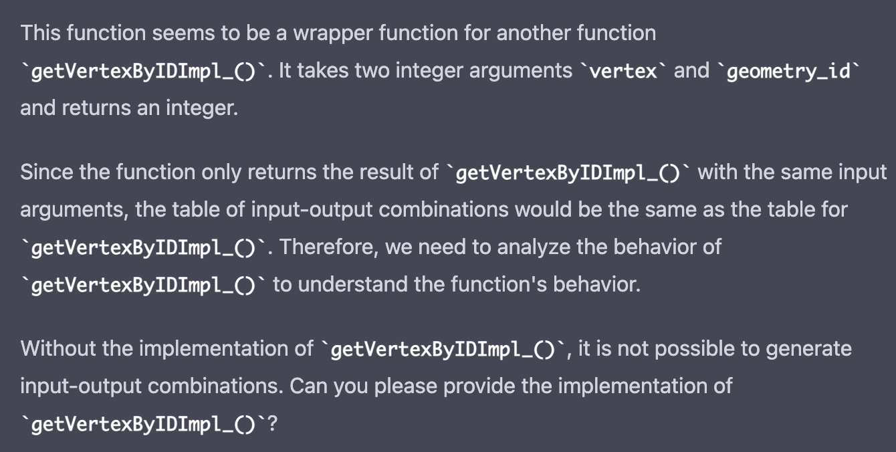

## Prompt - 1
```
For the following function, generate any 5 combinations of inputs and return the result as a table and explain the execution of each input-output combination: 
int getVertexByID_(int vertex, int geometry_id) {
    if (geometry_id == -1)
        return vertex;
    
    return getVertexByIDImpl_(vertex, geometry_id);
}
```

## Output - 1
Input-output combinations:


## Observation - 1
- ChatGPT is correct to identify the dependent methods.

## Prompt - 2
```
This is the implementation of getVertexByIDImpl_() method:
int getVertexByIDImpl_(int vertex, int geometry_id) {
		EditShape shape = m_topo_graph.getShape();
		int v;
		int geometry;
		int vertex_iterator = m_topo_graph
				.getClusterVertexIterator(m_topo_graph
						.getClusterFromVertex(vertex));

		do {
			v = m_topo_graph.getVertexFromVertexIterator(vertex_iterator);
			geometry = shape.getGeometryFromPath(shape.getPathFromVertex(v));

			if (geometry == geometry_id)
				return v;

			vertex_iterator = m_topo_graph
					.incrementVertexIterator(vertex_iterator);
		} while (vertex_iterator != -1);

		return vertex;
	}

Now, generate any 5 combinations of inputs and return the result as a table and explain the execution of each input-output combination for previously provided getVertexByID_() method.
```

## Output - 2
Unfortunately, without information about the input and how the m_topo_graph and shape objects are initialized, it is not possible to generate meaningful input-output combinations for the getVertexByID_() method. Additionally, the getVertexByIDImpl_() method is necessary to understand how the getVertexByID_() method works, and there is no information about how it is called or used in the code.

## Observation - 2
- For Java projects, the methods are highly interdependent on each other so the context required for finding the input-output combinations is huge.
- By providing all the methods and objects of various methods ChatGPT could be able to generate the output.