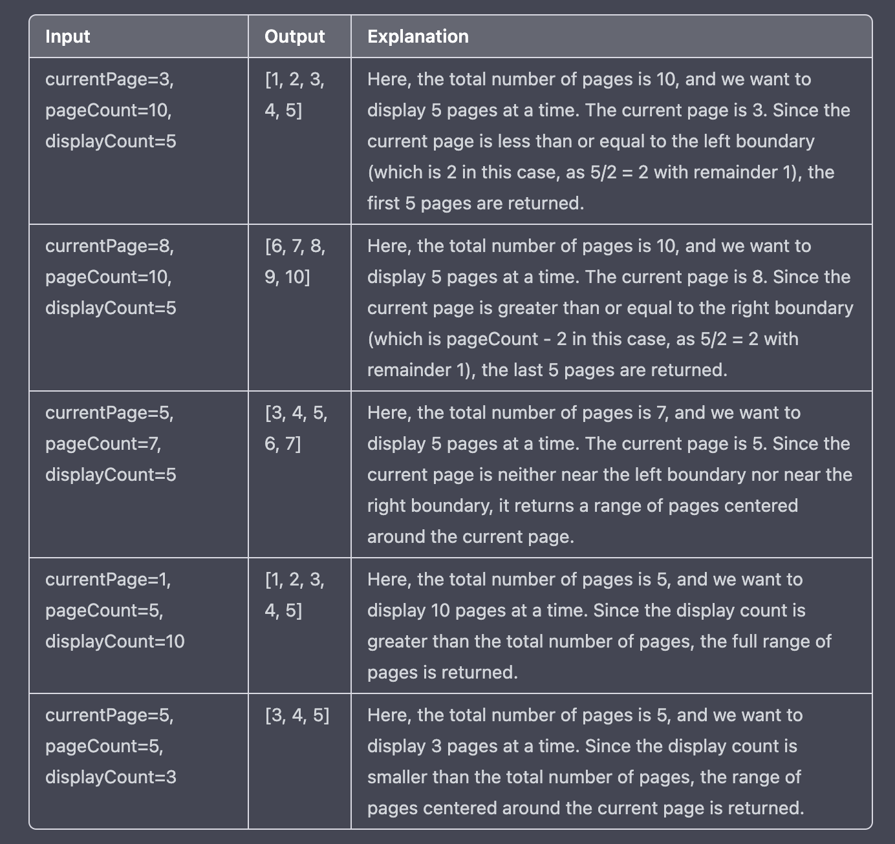

## Prompt - 1
```
For the following function, generate any 5 combinations of inputs and return the result as a table and explain the execution of each input-output combination: 
public static int[] rainbow(int currentPage, int pageCount, int displayCount) {
    boolean isEven = true;
    isEven = displayCount % 2 == 0;
    int left = displayCount / 2;
    int right = displayCount / 2;

    int length = displayCount;
    if (isEven) {
        right++;
    }
    if (pageCount < displayCount) {
        length = pageCount;
    }
    int[] result = new int[length];
    if (pageCount >= displayCount) {
        if (currentPage <= left) {
            for (int i = 0; i < result.length; i++) {
                result[i] = i + 1;
            }
        } else if (currentPage > pageCount - right) {
            for (int i = 0; i < result.length; i++) {
                result[i] = i + pageCount - displayCount + 1;
            }
        } else {
            for (int i = 0; i < result.length; i++) {
                result[i] = i + currentPage - left + (isEven ? 1 : 0);
            }
        }
    } else {
        for (int i = 0; i < result.length; i++) {
            result[i] = i + 1;
        }
    }
    return result;
}
```

## Output - 1
Input-output combinations:


Explanation of each input-output combination:

1. yearAndQuarter(1640995200000, 1672435199999): In this case, two long values are passed as arguments to the yearAndQuarter function, which represent the start and end dates in milliseconds since the epoch (January 1, 1970). The quarters LinkedHashSet is initialized, and a Calendar object is created based on the start date. The while loop runs until the start date is greater than the end date. Inside the loop, the yearAndQuarter method is called with the current Calendar object and its result is added to the quarters LinkedHashSet. Then, the Calendar object is updated to the start of the next quarter by adding 3 months. Finally, the start date is updated to the time in milliseconds represented by the updated Calendar object. This process continues until the start date is greater than the end date. The resulting quarters LinkedHashSet contains the strings representing each quarter within the date range.

2. yearAndQuarter(1554076800000, 1559347199999): In this case, the start and end dates represent a range of two quarters in 2019. The quarters LinkedHashSet is initialized, and a Calendar object is created based on the start date. The while loop runs until the start date is greater than the end date. Inside the loop, the yearAndQuarter method is called with the current Calendar object and its result is added to the quarters LinkedHashSet. Then, the Calendar object is updated to the start of the next quarter by adding 3 months. Finally, the start date is updated to the time in milliseconds represented by the updated Calendar object. This process continues until the start date is greater than the end date. The resulting quarters LinkedHashSet contains the strings representing each quarter within the date range.

3. yearAndQuarter(1577836800000, 1583020799999): In this case, the start and end dates represent a range of two quarters in 2020. The quarters LinkedHashSet is initialized, and a Calendar object is created based on the start date. The while loop runs until the start date is greater than the end date. Inside the loop, the yearAndQuarter method is called with the current Calendar object and its result is added to the quarters LinkedHashSet. Then, the Calendar object is updated to the start of the next quarter by adding

## Observation - 1
- ChatGPT is able to correct generate outputs given inputs.