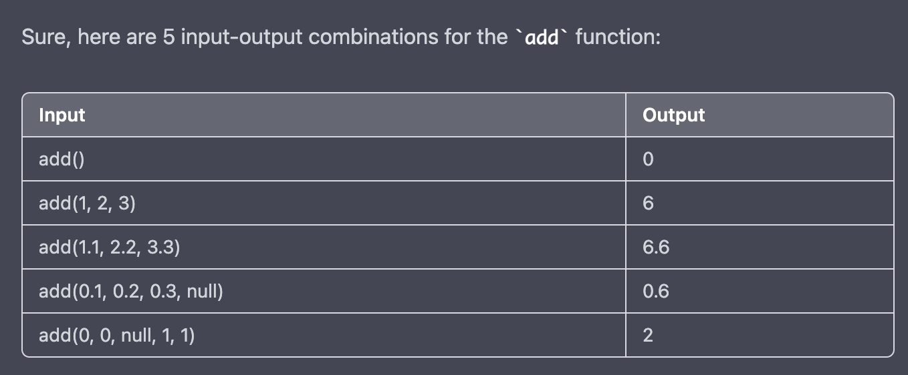

## Prompt - 1
```
For the following function, generate any 5 combinations of inputs and return the result as a table and explain the execution of each input-output combination: 
public static BigDecimal add(Number... values) {
    if (ArrayUtil.isEmpty(values)) {
        return BigDecimal.ZERO;
    }

    Number value = values[0];
    BigDecimal result = toBigDecimal(value);
    for (int i = 1; i < values.length; i++) {
        value = values[i];
        if (null != value) {
            result = result.add(toBigDecimal(value));
        }
    }
    return result;
}
```

## Output - 1
Input-output combinations:


Explanation of each input-output combination:

1. add(): In this case, no arguments are passed to the add function. Since the values array is empty, the function returns BigDecimal.ZERO.

2. add(1, 2, 3): In this case, three integers are passed as arguments to the add function. The result variable is initialized to 1 (the first value in the values array), and then the for loop iterates over the remaining values in the values array (2 and 3). The result variable is updated in each iteration by adding the current value to the previous value. After the loop completes, the result variable is returned with the value 6.

3. add(1.1, 2.2, 3.3): In this case, three decimal values are passed as arguments to the add function. The result variable is initialized to 1.1 (the first value in the values array), and then the for loop iterates over the remaining values in the values array (2.2 and 3.3). The result variable is updated in each iteration by adding the current value to the previous value. After the loop completes, the result variable is returned with the value 6.6.

4. add(0.1, 0.2, 0.3, null): In this case, four decimal values are passed as arguments to the add function, including a null value. The result variable is initialized to 0.1 (the first value in the values array), and then the for loop iterates over the remaining values in the values array (0.2, 0.3, and null). Since the fourth value is null, it is skipped in the loop. The result variable is updated in each iteration by adding the current value to the previous value. After the loop completes, the result variable is returned with the value 0.6.

5. add(0, 0, null, 1, 1): In this case, five values are passed as arguments to the add function, including two null values. The result variable is initialized to 0 (the first value in the values array), and then the for loop iterates over the remaining values in the values array (0, null, 1, and 1). Since the second value is null, it is skipped in the loop. The result variable is updated in each iteration by adding the current value to the previous value. After the loop completes, the result variable is returned with the value 2.

## Observation - 1
The  generated input-output combinations are correct.