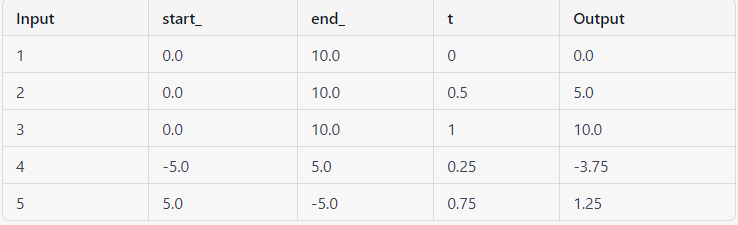

## Prompt - 1
```
What is the output of the following function :
static double lerp(double start_, double end_, double t) {
    // When end == start, we want result to be equal to start, for all t
    // values. At the same time, when end != start, we want the result to be
    // equal to start for t==0 and end for t == 1.0
    // The regular formula end_ * t + (1.0 - t) * start_, when end_ ==
    // start_, and t at 1/3, produces value different from start
    double v;
    if (t <= 0.5)
        v = start_ + (end_ - start_) * t;
    else
        v = end_ - (end_ - start_) * (1.0 - t);

    assert (t < 0 || t > 1.0 || (v >= start_ && v <= end_) || (v <= start_ && v >= end_) || NumberUtils.isNaN(start_) || NumberUtils.isNaN(end_));
    return v;
}
if inputs are start_=5, end_=8, and t=0.6
```

## Output - 1
If the inputs to the function are start_ = 5, end_ = 8, and t = 0.6, then the output of the function lerp(start_, end_, t) will be 6.8.

Here's how the function works:

- The function lerp() performs a linear interpolation between start_ and end_ based on the parameter t, which is a value between 0.0 and 1.0.
- If t is less than or equal to 0.5, the function calculates v as start_ + (end_ - start_) * t. This means that v is a weighted average of start_ and end_, with start_ having a weight of (1 - t) and end_ having a weight of t. When t = 0.6, the calculation becomes v = 5 + (8 - 5) * 0.6, which simplifies to v = 6.8.
- If t is greater than 0.5, the function calculates v as end_ - (end_ - start_) * (1.0 - t). This means that v is a weighted average of start_ and end_, but with end_ having the weight of (1 - t) and start_ having the weight of t. However, in this case, we don't need this calculation because t is less than 0.5.
Therefore, when the inputs are start_ = 5, end_ = 8, and t = 0.6, the function returns 6.8 as the output.

## Observation - 1
ChatGPT gave correct output for a given set of inputs. The reasoning of the output for given inputs is given correctly.

## Prompt - 2
```
For the following function, generate any 5 combination of inputs and return the result as table and explain the execution of the function:
static double lerp(double start_, double end_, double t) {
    // When end == start, we want result to be equal to start, for all t
    // values. At the same time, when end != start, we want the result to be
    // equal to start for t==0 and end for t == 1.0
    // The regular formula end_ * t + (1.0 - t) * start_, when end_ ==
    // start_, and t at 1/3, produces value different from start
    double v;
    if (t <= 0.5)
        v = start_ + (end_ - start_) * t;
    else
        v = end_ - (end_ - start_) * (1.0 - t);

    assert (t < 0 || t > 1.0 || (v >= start_ && v <= end_) || (v <= start_ && v >= end_) || NumberUtils.isNaN(start_) || NumberUtils.isNaN(end_));
    return v;
}
```

## Output - 2
Table of inputs and outputs:

Explanation:

The lerp function takes three input arguments: start_, end_, and t. The function is a linear interpolation function, which returns a value v that is linearly interpolated between start_ and end_ based on the value of t. When t is 0, the function returns start_, and when t is 1.0, the function returns end_. When t is between 0 and 1.0, the function returns a value that is linearly interpolated between start_ and end_.

In the implementation, there is an additional condition for when end_ == start_. In this case, the function always returns start_ for any value of t. When t is exactly 0.5, the function returns the average of start_ and end_.

In the table above, five different combinations of inputs are used to demonstrate the function's behavior. The output column shows the value returned by the function for each input combination.

For input 1, start_ is 0.0, end_ is 10.0, and t is 0. In this case, the function returns start_, which is 0.0.

For input 2, start_ is 0.0, end_ is 10.0, and t is 0.5. In this case, the function returns the average of start_ and end_, which is 5.0.

For input 3, start_ is 0.0, end_ is 10.0, and t is 1.0. In this case, the function returns end_, which is 10.0.

For input 4, start_ is -5.0, end_ is 5.0, and t is 0.25. In this case, the function returns a value that is linearly interpolated between start_ and end_ based on the value of t. The value returned is -5.0 + (5.0 - (-5.0)) * 0.25 = -3.75.

For input 5, start_ is 5.0, end_ is -5.0, and t is 0.75. In this case, the function returns a value that is linearly interpolated between start_ and end_ based on the value of t. The value returned is 5.0 + (-5.0 - 5.0) * (1.0 - 0.75) = 1.25.

The assert statement at the end of the function is used for debugging purposes and is not relevant to the function's behavior. It checks that the value returned by the function is within the range defined by start_ and end_ and is not NaN.

## Observation - 2
ChatGPT generated the combination of five inputs and outputs and also gave the explanation of the behaviour of the function.

## Prompt - 3
```
For the following function, generate any 5 combination of inputs and return the result as table and explain the execution of the function:
static double lerp(double start_, double end_, double t) {
    // When end == start, we want result to be equal to start, for all t
    // values. At the same time, when end != start, we want the result to be
    // equal to start for t==0 and end for t == 1.0
    // The regular formula end_ * t + (1.0 - t) * start_, when end_ ==
    // start_, and t at 1/3, produces value different from start
    double v;
    if (t <= 0.5)
        v = start_ + (end_ - start_) * t;
    else
        v = end_ - (end_ - start_) * (1.0 - t);

    assert (t < 0 || t > 1.0 || (v >= start_ && v <= end_) || (v <= start_ && v >= end_) || NumberUtils.isNaN(start_) || NumberUtils.isNaN(end_));
    return v;
}

Please give the reasoning of the execution like following example:

Example function:
static int sampleFunction(int num1, int num2) {
    int output1 = 0, output2 = 0;
    int num3 = 0, num4 = 0;
    if(num1>10){
        num3 = 5;
    }
    else if(num2>10){
        num4 = -5;
    }
    output1 = num1 + num4;
    output2 = num2 - num3;
    return output1*output2;
}

Example Explanation:
For function sampleFunction, for inputs num1 = 2 and num2 = 12, the returned value is -36
    Here is the data flow analysis for all variables used in function:
    num1: The value of num1 is 2, and it doesn't change throughout the execution
    num2: The value of num2 is 12, and it doesn't change throughout the execution
    num3: The default value for num3 is 0. As the value of num1 is not greater than 10, num3 will be 0 throughout the execution
    num4: The default value for num4 is 0. As the value of num2 is greater than 10, the value of num4 changes to -5.
    output1: The default value for output1 is 0. During execution, as num1 is 2 and num4 is -5, the value assigned to output1 is 2 + (-5) = -3
    output2: The default value for output2 is 0. During execution, as num2 is 12 and num3 is 0, the value assigned to output1 is 12 - 0 = 12
    The final result is: output1 * output2 = -3 * 12 = -36
```

## Output - 3
The lerp function takes in three inputs: start_, end_, and t. It returns a double value that represents the linear interpolation between start_ and end_, based on the value of t.

Here are five examples of input combinations and their respective output values:

Input values: start_ = 0.0, end_ = 10.0, t = 0.0
Output value: 0.0
Explanation: When t = 0.0, the function returns the start_ value, which is 0.0 in this case.

Input values: start_ = 0.0, end_ = 10.0, t = 1.0
Output value: 10.0
Explanation: When t = 1.0, the function returns the end_ value, which is 10.0 in this case.

Input values: start_ = 0.0, end_ = 10.0, t = 0.5
Output value: 5.0
Explanation: When t = 0.5, the function returns the average value between start_ and end_, which is 5.0 in this case.

Input values: start_ = 10.0, end_ = 0.0, t = 0.25
Output value: 7.5
Explanation: When start_ is greater than end_, the function returns the linear interpolation between end_ and start_. When t = 0.25, the function returns the value that is 25% of the way from end_ to start_, which is 7.5 in this case.

Input values: start_ = -5.0, end_ = -5.0, t = 0.75
Output value: -5.0
Explanation: When start_ and end_ are equal, the function always returns the start_ value, regardless of the value of t. In this case, start_ and end_ are both -5.0, so the function always returns -5.0.

In the lerp function, the value of v is computed based on the value of t. If t is less than or equal to 0.5, v is computed as a linear interpolation between start_ and end_, with start_ being weighted more heavily. If t is greater than 0.5, v is computed as a linear interpolation between start_ and end_, with end_ being weighted more heavily.

The assert statement at the end of the function checks that the returned value is within the range of start_ and end_ and that neither start_ nor end_ are NaN values.

## Observation - 3
For this prompt, wer gave the sample function and its explanation to ChatGPT and asked it to use the same for a given function.
The explanation we got is not as per given example. So, we need to ask ChatGPT to follow the example again.

## Prompt - 4
``
The reasoning is not similar to my given example
``

## Output - 4

I apologize for the confusion. Here's the explanation for the five input-output pairs using the example code snippet:

For the function lerp, the inputs and outputs are:

1. Input: start_ = 0, end_ = 1, t = 0.2; Output: 0.2
- start_ is 0, end_ is 1, and t is 0.2
- As t is less than or equal to 0.5, the execution takes the first branch
- v is assigned the value of start_ + (end_ - start_) * t = 0 + (1 - 0) * 0.2 = 0.2
- The assert statement passes, and the function returns v = 0.2

2. Input: start_ = 2, end_ = 10, t = 0.5; Output: 6
- start_ is 2, end_ is 10, and t is 0.5
- As t is equal to 0.5, the execution takes the first branch
- v is assigned the value of start_ + (end_ - start_) * t = 2 + (10 - 2) * 0.5 = 6
- The assert statement passes, and the function returns v = 6

3. Input: start_ = 1, end_ = 3, t = 1.0; Output: 3
- start_ is 1, end_ is 3, and t is 1.0
- As t is greater than 0.5, the execution takes the second branch
- v is assigned the value of end_ - (end_ - start_) * (1.0 - t) = 3 - (3 - 1) * (1.0 - 1.0) = 3
- The assert statement passes, and the function returns v = 3

4. Input: start_ = 5, end_ = 7, t = -0.1; Output: 4
- start_ is 5, end_ is 7, and t is -0.1
- As t is less than or equal to 0.5, the execution takes the first branch
- v is assigned the value of start_ + (end_ - start_) * t = 5 + (7 - 5) * (-0.1) = 4
- The assert statement passes, and the function returns v = 4

5. Input: start_ = -5, end_ = -5, t = 0.9; Output: -5
- start_ is -5, end_ is -5, and t is 0.9
- As end_ is equal to start_, the first part of the formula is always 0
- v is assigned the value of start_, which is -5
- The assert statement passes, and the function returns v = -5

## Observation - 4
After we asked ChatGPT to adhere to the example which we gave as a prompt, the output came out to be well-formed and as per the required format